# public.lpu23x.firmware

## firmware 파일 종류
### 확장자가 bin 인 fimware 파일
* 마이컴이 직접 실행 할 수 있는 이진 데이터가 저장된 파일.
* 어느 장비에 사용되는 이진 데이터인지 알수 없음.
  * 크기가 항상 32K bytes 인 파일 
    * bootloader 이진 데이터 와 application 이진 데이터가 같이 있음.
    * 생산시 이 파일 꼭 필요.
  * 크기가 24K bytes 이하 인 파일
    * application 이진 데이터만 있음.
    * mapper 로 강제 firmware 변경시 사용.
### 확장자가 rom 인 fimware 파일
* 1개 이상의 application 이진 데이터들과 application 에 관한 정보를 포함.
* 자세한 형식은 [홈페이지](https://blog.naver.com/elpusk/222897017053) 참고. 

## lpu237 - [history](./doc/history_lpu237.md) 및 lpu238 - [history](./doc/history_lpu238.md)
### 2023.10.11
* 이 버전 부터 lpu237_숫자.rom 과 lpu238_숫자.rom 은 lpu23x_숫자.rom 으로 통합.
* 버전
  * callisto v3.23 ,ganymede v5.22, europa v1.1
* 배포 파일
  * [lpu23x_00027.zip](./lpu23x/lpu23x_00027.zip)
  * 이 전 버전이 lpu237_00026.rom 과 lpu238_00001.rom 이어서, 이 번 버전의 이름이 lpu23x_00027.rom 이 됨.
* 배포 파일 내용
  * lpu23x_00027.rom - callisto 용 v3.23 , ganymede 용 v5.22, europa 용 v1.1 이 포함된 ROM file.
  * Update 가능 조건 - target device 의 버전이 ROM 파일에 포함된 firmware 버전 보다 높거나 같음.
  * lpu237_3.23.bin - lpu23x_00027.rom 에 포함된 callisto 용 v3.23 firmware.
  * lpu237_5.22.bin - lpu23x_00027.rom 에 포함된 ganymede 용 v5.22 firmware.
  * lpu238_1.1.bin - lpu23x_00027.rom 에 포함된 europa 용 v1.1 firmware.
  * 일반적인 상황에서 firmware 를 업데이트 할 때, lpu23x_00027.rom 를 사용.
  * A/S 등 기타 상황에서 강제로 firmware 를 업데이트 할 때, lpu237_3.23.bin ,lpu237_5.22.bin 또는 lpu238_1.1.bin 를 사용.
* Update program
  * lpu230.exe(Mapper v1.46.0.4 이상 사용). [Installer](https://github.com/elpusk/public.lpu237.software)
  * 업데이트 방법은 Mapper 설치 후, 포함된 Mapper 사용설명서 참고. 
* 변경 내역
  * i-button None Mode 에서, USB keyboard interface 면, i-button 전송범위 선택 가능 추가.
  * i-button None Mode 에서, Virtual COM interface 면, i-button 전송범위 선택 가능 추가.
  * i-button None Mode 에서, Real COM interface 면, i-button 전송범위 선택 가능 추가.


## lpu230_update
이 프로그램은 lpu237, lpu238 firmware 를 mapper(lpu230.exe) 설치 없이 변경 할 수 있다.

단, 일반적인 경우, mapper(lpu230.exe)를 통한 firmware update가 권장됩니다.

* 버전
  * lpu230_update.exe v1.4 (2023.2.26 업데이트)
* 배포 파일
  * [lpu230_update_v1.4.zip](./lpu230_update/lpu230_update_v1.4.zip)
* 배포 파일 내용
  * lpu230_update.exe v1.4 - 실행파일
  * ng_DDL_hid.dll v1.4 - lpu230_update.exe 가 사용하는 dll.
  * tg_rom.dll v1.2 - lpu230_update.exe 가 사용하는 dll.
  * lpu230_update_UM_EN_005.pdf - 영문판 일반 사용 설명서.
  * lpu230_update_UM_KOR_005.pdf - 한글판 일반 사용 설명서.
* 사용방법
  1. [lpu230_update_v1.4.zip](./lpu230_update/lpu230_update_v1.4.zip) 를 다운받아 원하는 폴더에 압축을 해제.
  2. lpu230_update.exe, ng_DDL_hid.dll 과 tg_rom.dll 가 동일한 폴더에 있는지 확인.
  3. 일반 사용 설명서의 내용에 따라 원하는 rom 파일 다운받아 사용.
* 특수 기능 - 아주 예외적인 경우를 제외하고, 아래에 설명하는 기능은 사용자제.
  * v1.4 부터 추가된 "-mmd1100_iso_mode" 또는 "-mmd1100_binary_mode" 옵션.
    - lpu237 펨웨어를 v5.22.0.1로 업데이트 할 때만 효과 발생.
    - lpu237  v5.22.0.1 펨웨어는 이 레포지토리의 mmd1100_iso_mode 브랜치에서만 얻을 수 있음.
    - "-mmd1100_iso_mode" 또는 "-mmd1100_binary_mode" 옵션은 -q 또는 -qa 옵션도 같이 사용 가능.
    - mmd1100 decoder mode는 iso 또는 binary가 존재.
    - mmd1100 decoder mode 기본값은 binary.
    - mmd1100 decoder mode는 mmd1100 decoder 의 OTP 에 저장되는데, 2번 만 변경 가능.
    - mmd1100 decoder chip 생산 단계에서, binary mode 로 변경하기 때문데, 사용자는 실제로 한 번만 mode 변경 가능.
    - lpu237 decoder 가 mmd1100 이 아니 경우, "-mmd1100_iso_mode" 또는 "-mmd1100_binary_mode" 옵션 실행은 decoder 가 mmd1100로 변경되기 전까지 아무런 효과가 없음.
    - mmd1100 decoder 를 사용하는 lpu237을 "-mmd1100_iso_mode" 옵션을 가지고, v5.22.0.1로 업데이트 한 경우.
      + 업데이트가 성공적으로 완료되면, 부저가 한 번 울리고, 그 후, system parameter 복구 후, mmd1100 를 정상적으로 iso mode 로 설정이 불가능한 경우, 부저가 짧게 두 번 울림.
      + "-mmd1100_iso_mode" 또는 "-mmd1100_binary_mode" 옵션은 lpu237 마이컴 플래쉬 메모리에 mmd1100 decoder mode에 대응하는 system parameter 를 선택된 mode 로 설정하고, 마이컴은 이 system parameter 에 따라, reset 또는 system 작업(mapper 실행 등) 시작 시, mmd1100 을 선택된 mode로 변경을 시도함.
      + mmd1100 mode 변경이 실패한 경우, 부저가 짧게 두 번 울림. 
    - "-mmd1100_iso_mode" option 사용 방법.
      1. lpu230_update.exe 와 같은 폴더에, ng_DDL_hid.dll, tg_rom.dll, lpu237_g522_0_1.rom 가 있는지 확인.
      2. 콘솔에서 -mmd1100_iso_mode option 으로 lpu230_update.exe 를 실행.
    ``` 
    lpu230_update -mmd1100_iso_mode
    ```
      3. 잠시 후, 화면에 업데이트 과정이 표시 되고, 끝날때 까지 기다림. 

  * lpu237-mw003 model를 lpu238-mw003 model 로 변경하고, interface를 virtual COM으로 설정.
    1. 콘솔에서 -m2 option 으로 lpu230_update.exe 를 실행.( 여기서 virtual COM interface 번호가 2, 1 은 usb vendor defined HID, 0 은 usb keyboard, 10은 read uart)
    ``` 
    lpu230_update -m2 
    ```
    2. "Update" 버튼 실행.
    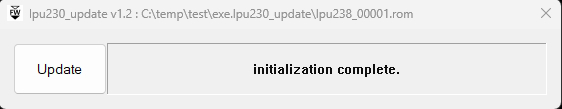
    3. "Select rom file" dialog box 에서 "Yes".
    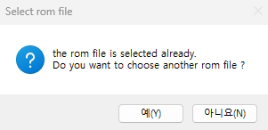
    4. lpu238_x.rom 파일 선택.
    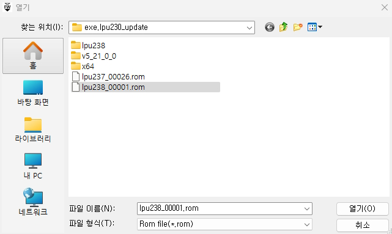
    5. "Selects firmware" dialog box 에서 "europa" 선택.
    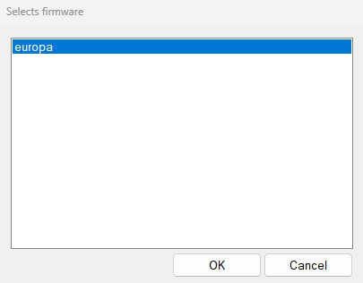
    6. "Notice" message boxdialog box 에서 "Yes".
    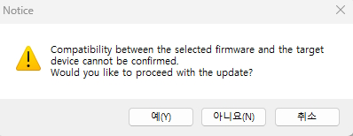
    7. upate 진행 중. 기다림.
    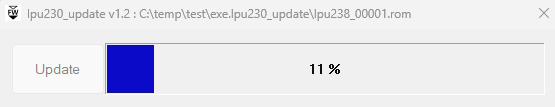
    8. upate 완료.
    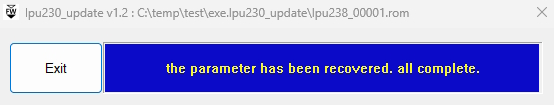
    8. devce manager 에서 Virtual COM 확인.
    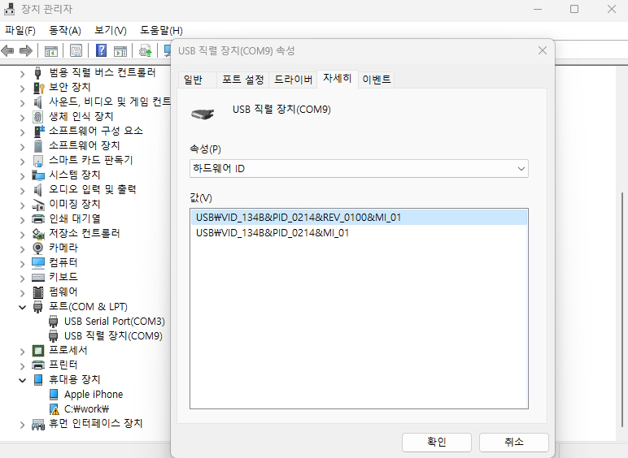


  * lpu238-mw003 model를 lpu237-mw003 model 로 변경하고, interface를 usb keyboard로 설정.
    1. 콘솔에서 -m0 option 으로 lpu230_update.exe 를 실행.( 여기서 usb keyboard interface 번호가 0)
    ``` 
    lpu230_update -m0 
    ```
    2. "Update" 버튼 실행.
    
    3. "Select rom file" dialog box 에서 "Yes".
    
    4. lpu237_x.rom 파일 선택.
    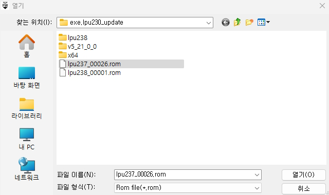
    5. "Selects firmware" dialog box 에서 "ganymede" 선택.
    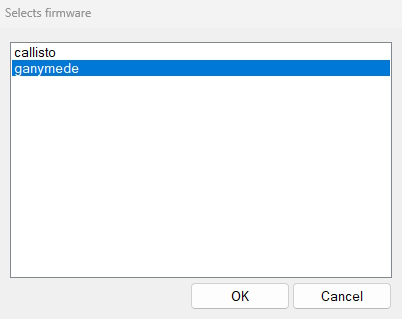
    6. "Notice" message boxdialog box 에서 "Yes".
    
    7. upate 진행 중. 기다림.
    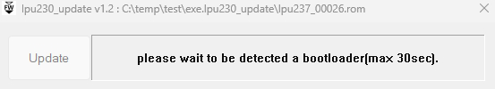
    8. upate 완료.
    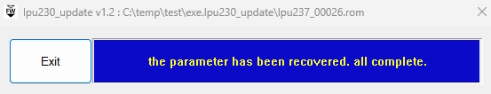
    8. devce manager 에서 usb HID 장치 확인.
    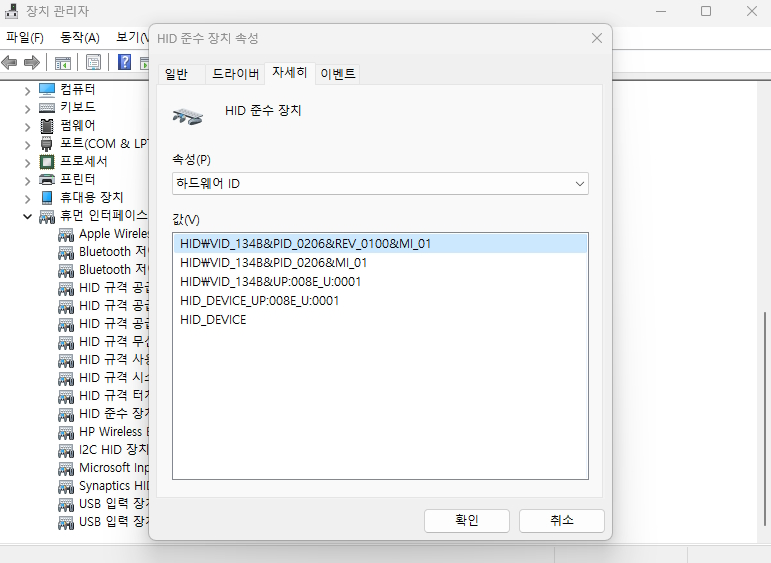7

    